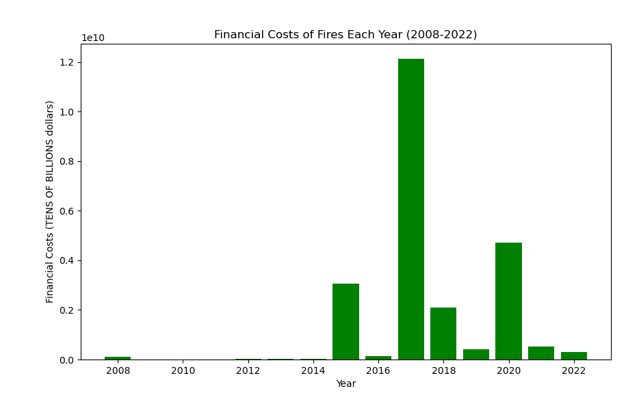
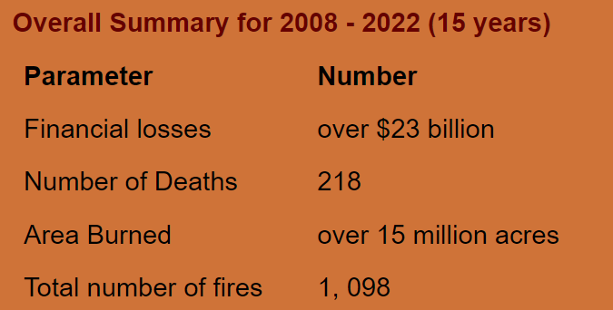

# Fire-Analysis: The Growing Threat of Wildfires and Their Costs

## Project Collaborators:

* [Theresa F.](https://github.com/TheresaFregoso)
* [Scott J.](https://github.com/UtahPando)
* [Sabrina L.](https://github.com/LegallyNotBlonde)
___

## Project Tracker

* We started with the original data in PDF format, with each year in a separate file. 
* Using code, we extracted this data into Excel, parsed the relevant pages, and transformed it into key metrics using Pandas libraries. 
* We then created an SQL schema to store the data and used JavaScript to build HTML pages with interactive dashboards. 
* Pandas was also used for various visualizations. Due to our group's limited size and time constraints, we divided the project into smaller tasks, allowing us to work in parallel. 
* This approach has lead to multiple code files in this repository.

### Overview & Call to Action

* This project highlights the severe impact of wildfires in California from 2008 to 2022, with data-driven insights on frequency, damage, and risk areas.
* While initially educational, the findings reveal a need for immediate action to mitigate the escalating threat of wildfires.

___

### Key Findings and Charts

* Acres Burned: 2020 and 2018 saw unprecedented spikes, indicating more severe wildfires.
* Financial Costs: 2017 marked a peak, with fires costing over $12 billion, emphasizing the economic devastation.
* Median Fire Duration: Notably high in 2016, 2020, and 2022, suggesting prolonged fires contribute significantly to overall damage.
* Total Deaths: 2018 was particularly deadly, underscoring the human cost of these disasters.

#### *Please find more details in the separate presentation included in this repo.*

### Actionable Steps
* **Home Fireproofing**: Visit the **[CAL FIRE Ready]()** for Wildfire page for tips on using fire-resistant materials and creating defensible spaces around your property.
* **Grant Opportunities:** Check the **[Grants and Funding page]()** to see if you qualify for grants, including those from the **[Marin Wildfire]()** Prevention Authority.
* **Advocacy:** Advocate for stronger fire prevention policies by pushing local and federal governments to invest in forest management, public education, and soil moisture improvement strategies.

___

### Conclusion
The data underscores the unpredictable nature of wildfires and their increasing severity. While the frequency of fires fluctuates, the damage—both economic and human—demands urgent and sustained preventive measures. Now is the time to take action to protect lives and properties from future catastrophes.

### Key Takeaway for Viewers
This project, while independent and exploratory, offers valuable insights:
    * **County-Level Risk Assessment:** Access localized fire statistics and risk assessments here. You can check information about your county [HERE](LINK TO BE ADDED).
    * **Economic Impact:** In **2017**, California's fires cost over **$12 billion**. From **2008-2022, total damages exceeded $24 billion**, excluding human and environmental costs, and costs of containing fires.
    * Yearly Statistics can be found *[HERE](https://example.com/yearly-statistics).*
    * **Policy Implications:** Preventative measures, though costly, could be more cost-effective than the devastating damages from wildfires.
    * **Real Estate Considerations:** When buying property in California, consider fire risks alongside other factors like earthquakes, as they significantly impact insurance costs.
___

### Ethical Consideration

* **Data Integrity:** We maintained a strong focus on accuracy, transparency, and ethical data handling throughout the project.

* **Limitations:** The dataset mainly covers larger fires (300+ acres), which might exclude smaller yet impactful events. Repeated fire names across counties and inconsistent fire duration data present challenges, but our focus on yearly trends mitigates these issues.

*This project is licensed under the GNU General Public License v3.0. For more details, please refer to the 'LICENSE' file.*
___

### Methodologies and Programming Languages Used
* Pandas libraries 
* Python (including but not limited to '**ast**' to process trees of the Python abstract syntax grammar)
* SQL 
* JavaScript

___

### Repo Structure
* **[Resources folder](https://github.com/LegallyNotBlonde/Fire-Analysis/tree/main/Resources)** contains original, raw data sets
* **[Outputs](https://github.com/LegallyNotBlonde/Fire-Analysis/tree/main/Outputs)** includes transformed data and tables
* **[Charts](https://github.com/LegallyNotBlonde/Fire-Analysis/tree/main/Charts)** folder contains various visualization displays
* **Files with codes** have **self-explanatory names** and are available in the [main body of the repo](https://github.com/LegallyNotBlonde/Fire-Analysis)
* **[Presentation](https://docs.google.com/presentation/d/18218T6EQrjeQu0vUXJoN1WikxMXPLT6Y-v4c-PHHHL0/edit#slide=id.p)** with more information about the projects and all necessary charts.
* ### *[Link to the interactive visualization](http://127.0.0.1:5500/index.html)*

___

### Resourses 
* [California State Geoportal](https://gis.data.ca.gov/)
* [Youtube Link](https://www.youtube.com/watch?v=VEtICDT_ZmI) to display fire siren created by [Kermit the sound](https://www.youtube.com/@kermitthesound389)
* AdobeStock - Image for the title presentation page
* ChatGPT provided an idea for 'ast' library to process trees of the Python abstract syntax grammar
